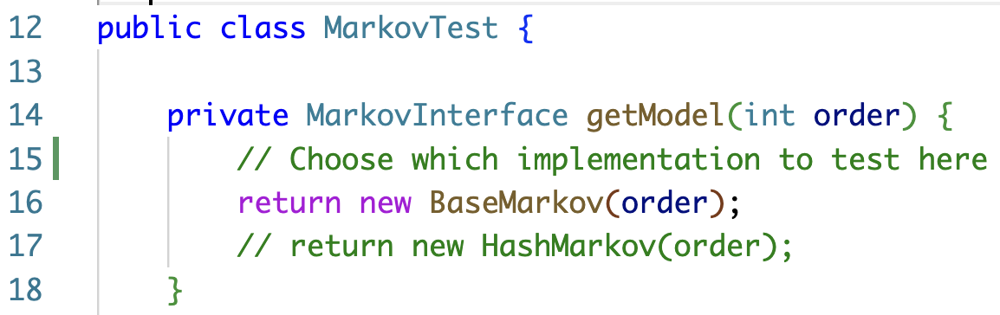
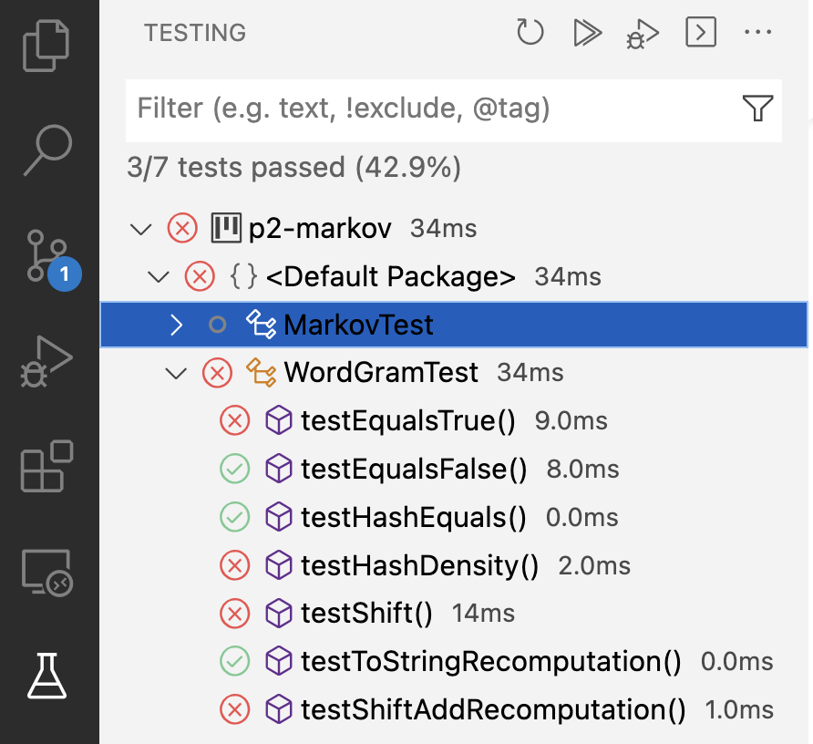

# Project Markov

This is the directions document for Project Markov
También está la versión traducida en español


## Outline

- [Introduction](#introduction)
  - [What is a WordGram?](#what-is-a-wordgram)
  - [What is a Markov Model?](#what-is-a-markov-model)
- [Running Driver Code](#running-driver-code)
- [JUnit Tests](#junit-tests)
- [Coding Part 1: Developing the WordGram Class](#coding-part-1-developing-the-wordgram-class)
- [Coding Part 2: Developing the HashMarkov Class](#coding-part-2-developing-the-hashmarkov-class)
- [Versión traducida en español](#versión-traducida-en-español)


## Introduction

Random Markov processes are widely used in Computer Science and in analyzing different forms of data. This project offers an occasionally amusing look at a *generative model* for creating realistic looking text in a data-driven way. To do so, you will implement two classes: First `WordGram` which represents immutable sequences of words, then `HashMarkov` which will be an efficient model for generating random text that uses `WordGram`s and `HashMap`s.

Generative models of the sort you will build are of great interest to researchers in artificial intelligence and machine learning generally, and especially those in the field of *natural language processing* (the use of algorithmic and statistical AI/ML techniques on human language). One recent and powerful example of such text-generation model via statistical machine learning program is the [OpenAI GPT-3](https://openai.com/blog/gpt-3-apps/).


### What is a `WordGram`

You will implement a class called `WordGram` that represents a sequence of words (represented as strings), just like a Java String represents a sequence of characters. Just as the Java String class is an immutable sequence of characters, the `WordGram` class you implement will be an immutable sequence of strings. Immutable means that once a WordGram object has been created, it cannot be modified. You cannot change the contents of a `WordGram` object. However, you can create a new WordGram from an existing `WordGram`.

The number of strings contained in a `WordGram` is sometimes called the *order* of the WordGram, and we sometimes call the `WordGram` an *order-k* WordGram, or a *k-gram* -- the term used in the Markov program you'll implement for Part 2.  You can expand below to see some examples of order-3 `WordGram` objects.

<details>
<Summary>Expand to see examples of order-3 `WordGram`s</summary>

| | | |
| --- | --- | --- |
| "cat" | "sleeping" | "nearby" |
| | | |

and 
| | | |
| --- | --- | --- |
| "chocolate" | "doughnuts" | "explode" |
| | | |

</details> 

### What is a Markov Model?

Markov models are random models with the Markov property. In our case, we want to create a Markov model for generating random text that looks similar to a training text. We will generate one random word at a time, and the Markov property in our context means that the probabilities for that next word will be based on the previous words.

An order-k Markov model uses order-k `WordGram`s to predict text: we sometimes call these *k-grams* where *k* refers to the order. To begin, we select a random k-gram from the *training text* (the data we use to create our model; we want to generate random text similar to the training text). Then, we look for instances of that k-gram in the training text in order to calculate the probabilities corresponding to words that might follow. We then generate a new word according to these probabilities, after which we repeat the process using the last k-1 words from the previous k-gram and the newly generated word. Continue in that fashion to create the desired number of random words. 

Here is a concrete example. Suppose we are using an order 2 Markov model with the following training text (located in `testfile.txt`):

```
this is a test
it is only a test
do you think it is a test
this test it is ok
it is short but it is ok to be short
```

We begin with a random k-gram, suppose we get `[it, is]`. This appears 5 times in total, and is followed by `only`, `a`, `ok`, `short`, and again by `ok` each of those five times respectively. So the probability (in the training text) that `it is` is followed by `ok` is 2/5 or 40%, and for the other words is 1/5 or 20%. To generate a random word following the 2-gram `[it, is]`, we would therefore choose `ok` with 2/5 probability, or `only`, `a`, or `short` with 1/5 probability each.

Rather than calculating these probabilities explicitly, your code will use them implicitly. In particular, the `getFollows` method will return a `List` of *all* of the words that follow after a given k-gram in the training text (including duplicates), and then you will choose one of these words uniformly at random. Words that more commonly follow will be selected with higher probability by virtue of being duplicated in the `List`.

Suppose we choose `ok` as the next random word. Then the random text generated so far is `it is ok`, and the current `WordGram` of order 2 we are using would be updated to `[is, ok]`. We then again find the following words in the training text, and so on and so forth, until we have generated the desired number of random words.

Of course, for a very small training text these probabilities may not be very meaningful, but random generative models like this can be much more powerful when supplied with large quantities of training data, in this case meaning very large training texts.

<details>
<summary>Historical details of this assignment (optional)</summary>

This assignment has its roots in several places: a story named _Inflexible Logic_ now found in pages 91-98 from [_Fantasia Mathematica (Google Books)_](http://books.google.com/books?id=9Xw8tMEmXncC&printsec=frontcover&pritnsec=frontcover#PPA91,M1) and reprinted from a 1940 New Yorker story called by Russell Maloney. 
The true mathematical roots are from a 1948 monolog by Claude Shannon, [A Mathematical Theory of Communication](https://docs.google.com/viewer?a=v&pid=sites&srcid=ZGVmYXVsdGRvbWFpbnxtaWNyb3JlYWRpbmcxMmZhbGx8Z3g6MThkYzkwNzcyY2U5M2U5Ng) which discusses in detail the mathematics and intuition behind this assignment. This assignment has its roots in a Nifty Assignment designed by Joe Zachary from U. Utah, assignments from Princeton designed by Kevin Wayne and others, and the work done at Duke starting with Owen Astrachan and continuing with Jeff Forbes, Salman Azhar, Branodn Fain, and the UTAs from Compsci 201.
</details>


## Running Driver Code

The primary driver code for this assignment is located in `MarkovDriver.java`. You should be able to run the `public static void main` method of `MarkovDriver` immediately after cloning the starter code, and should see something like the output shown in the expandable section below (noting that your exact runtimes will likely be different / machine dependent).

<details><summary>Expand for example output of MarkovDriver with starter code</summary>

```
Trained on text in data/alice.txt with T=28196 words
Training time = 0.012 s
Generated N=100 random words with order 2 Markov Model
Generating time = 0.014 s
----------------------------------
 sorrowful ME' as to an a the with you things ring, deal enough!' ago: this unjust 
and felt Tortoise explanation; he forgetting WOULD the other it `That's person Duchess 
broken deal it. was Hare. talking simple old, thoughtfully. last Alice; while next 
away and held `poison,' the said at under King way?', only with could looking other 
it came and accidentally it she `and round smile. things children. very YOU copies 
in `why join to drowned `That had if I much did said: stop introduced or said out 
beautiful go she thank machine it at morsel beauti--FUL an
```

</details>

This initial output just looks like nonsense for now because the `WordGram` class is not correctly implemented; that will be your first coding task. Before starting to code however, you are encouraged to inspect `MarkovDriver` a little more closely to understand what it is doing. Expand the section below to see a description of the details of the `MarkovDriver` code.

<details><summary>Expand for details on `MarkovDriver`</summary>

- Some static variables used in the main method are defined at the top of class, namely:
  - `TEXT_SIZE` is the number of words to be randomly generated.
  - `RANDOM_SEED` is the random seed used to initialize the random number generator. You should always get the same random text given a particular random seed and training text.
  - `MODEL_ORDER` is the order of `WordGram`s that will be used.
  - `PRINT_MODE` can be set to true or false based on whether you want the random text generated to be printed.
- The `filename` defined at the beginning of the main method determines the file that will be used for the training text. By default it is set to `data/alice.txt`, meaning the text of *Alice in Wonderland* is being used. Note that data files are located inside the data folder.
- A `MarkovInterface` object named `generator` is created. By default, it uses `BaseMarkov` as the implementing class, a complete implementation of which is provided in the starter code. Later on, when you have developed `HashMarkov`, you can comment out the line using `BaseMarkov` and uncomment the line using `HashMarkov` to change which implementation you use.
- The `generator` then sets the specified random seed. You should get the same result on multiple runs with the same random seed. Feel free to change the seed for fun while developing and running, but *the random seed should be set to 1234 as in the default when submitting for grading*.
- The `generator` is timed in how long it takes to run two methods: first `setTraining()` and then `getRandomText()`.
- Finally, values are printed: The random text itself if `PRINT_MODE` is set to true and the time it took to train (that is, for `setTraining()` to run) the Markov model and to generate random text using the model (that is, for `getRandomText` to run). 

</details>

## JUnit Tests

To help test your `WordGram` and `HashMarkov` implementations, you are given some *unit tests* in `WordGramTest.java` and `MarkovTest.java`, both located in the `src` folder. A unit test specifies a given input and asserts an expected outcome of running a method, then runs your code to confirm that the expected outcome occurs. You can see the exact tests inside of the two files. 

Note that by default (to avoid compiler errors in the starter code), `MarkovTest` is testing the `BaseMarkov` implementation. When you are ready to test your `HashMarkov` implementation, you will want to change which model is created in the `getModel` method of `MarkovTest` at the position shown in the screenshow below (if the image does not render for you, you can find them in the `figures` folder).

<details>
<summary>Expand here for screenshot of getModel in MarkovTest</summary>

<div align="center">
  
</div>

</details>

In order **to run these tests** inside VS Code, click the [Test Explorer](https://code.visualstudio.com/docs/java/java-testing#_test-explorer) (beaker) icon on the left side of VS Code (it should be the lowest icon on the panel). You can expand the arrow for `p2-markov` and the default package to see two sets of tests: One for `MarkovTest` and another for `WordGramTest`. You can click the run triangle next to a test package to run the tests. Screenshot example in the expandable section below.

<details>
<summary>Expand here for screenshot running JUnit test in VS Code</summary>

<div align="center">
  
</div>

</details>

The main benefit of JUnit tests lies in their ability to examine isolated "units" of code — that is, to check correctness of a segment with minimal reliance on other relevant code and data. Additionally, the purpose of supplying these *local* (on your own machine) tests is to allow you to catch potential problems quickly without needing to rely on the (somewhat slower) Gradescope autograder until you are reasonably confident in your code. You do not have to use them for a grade.

<details>
<summary>Expand for optional JUnit details</summary>

We use a major Java library called [**JUnit**](https://junit.org/junit5/) (specifically version 5) for creating and running these unit tests. It is not part of the standard Java API, so we have supplied the requisite files `JAR` files (Java ARchive files) along with this project in a folder called `lib` (you don't need to do anything with this).   

</details>


## Coding Part 1: Developing the `WordGram` Class

Your first task is to develop the `WordGram` class itself. You're given an outline of `WordGram.java` with appropriate instance variables declared, as well as stub (not fully/correctly implemented) methods.

Your task will be to implement these methods in `WordGram` according to the specifications provided. Javadocs in the starter code detail the expected behavior of all methods. For `hashCode`, `equals`, and `toString`, your implementations should conform to the specifications as given in the [documentation for `Object`](https://docs.oracle.com/en/java/javase/17/docs/api/java.base/java/lang/Object.html). 

Note that `WordGram` objects are *immutable*, meaning they should not change after creation (similar to Java Strings). Therefore, none of the methods except the constructor should *mutate* (or change) the words assosciated with a `WordGram` object.

You can expand the sections below to see details about individual methods you need to implement.

<details>
<summary>Expand for details on the Constructor</summary>

You'll construct a `WordGram` object by passing as constructor arguments: an array, a starting index, and the size (or order) of the `WordGram.` You'll **store the strings in an array instance variable** by copying them from the array passed to the constructor.

There are three instance variables in `WordGram`:
```
private String[] myWords;
private String myToString;
private int myHash;
```

The constructor for WordGram `public WordGram(String[] source, int start, int size)`
should store `size` strings from the array `source`, starting at index `start` (of `source`) into the private `String` array instance variable `myWords` of the `WordGram` class. The array `myWords` should contain exactly `size` strings. 

For example, suppose parameter `words` is the array below, with "this" at index 0.

| | | | | | | |
| --- | --- | --- | --- | --- | --- | --- |
| "this" | "is" | "a" | "test" |"of" |"the" |"code" |
| | | | | | |

The call `new WordGram(words,3,4)` should create this array `myWords` since the starting index is the second parameter, 3, and the size is the third parameter, 4.

| | | | |
| --- | --- | --- | --- |
| "test" | "of" | "the" | "code"|
| | | | |

You can initialize the instance variables `myToString` and `myHash` in the constructor stub to whatever default values you choose; these will change when you implement the methods `.toString()` and `.hashCode()`, respectively.
</details>

<details>
<summary>Expand for details on wordAt()</summary>

The `wordAt()` method should return the word at the given index in `myWords`. 

</details>

<details>
<summary>Expand for details on length()</summary>

The `length()` method should return the order of the `WordGram`, that is, the length of `myWords`. 
</details>

<details>
<summary>Expand for details on equals()</summary>

The `equals()` method should return `true` when the parameter passed is a `WordGram` object with **the same strings in the same order** as this object. 

The [Java API specification of `.equals()`](https://docs.oracle.com/en/java/javase/17/docs/api/java.base/java/lang/Object.html#equals(java.lang.Object) takes an `Object` type as input. Thus, the first thing the `WordGram` `equals()` method should do is check if the parameter passed is really a `WordGram` using the `instanceof` operator, and if not return false. Otherwise, the parameter can be *cast* as a `WordGram`. This is done for you in the starter code and you do not need to change it.

Then what you need to do is compare the strings in the array `myWords` of `other` and `this` (the object on which `equals()` is called). Note that `WordGram` objects of different lengths cannot be equal, and your code should check this.

</details>

<details>
<summary>Expand for details on hashCode()</summary>

The `hashCode()` method should return an `int` value based on all the strings in instance variable `myWords`. See the [Java API documentation](https://docs.oracle.com/en/java/javase/17/docs/api/java.base/java/lang/Object.html#hashCode()) for the design constraints to which a `hashCode()` method should conform. 

Note that the Java String class already has a good [`.hashCode()` method](https://docs.oracle.com/en/java/javase/17/docs/api/java.base/java/lang/String.html#hashCode()) we can leverage. Use the `.hashCode()` of the String returned by `this.toString()` to implement this method.

Since `WordGram` objects are immutable (do not change after creation), you do not need to recompute the hash value each time `.hashCode()` is called. Instead, you can compute it the first time `.hashCode()` is called (which you can check against whatever default value you might set in the constructor), and store the result in the `myHash` instance variable. On subsequent calls, simply return `myHash`.
</details>

<details>
<summary>Expand for details on shiftAdd()</summary>

If this `WordGram` has k entries then the `shiftAdd()` method should create and return a _**new**_ `WordGram` object, also with k entries, whose *first* k-1 entries are the same as the *last* k-1 entries of this `WordGram`, and whose last entry is the parameter `last`. Recall that `WordGram` objects are immutable and cannot be modified once created - **this method must create a new WordGram object** and copy values correctly to return back to the user.

For example, if `WordGram w` is 
| | | |
| --- | --- | --- |
| "apple" | "pear" | "cherry" |
| | | | 

then the method call `w.shiftAdd("lemon")` should return a new `WordGram` containing {"pear", "cherry", "lemon"}. Note that this new `WordGram` will not equal w.

Note: To implement `shiftAdd()` you'll need to create a new `WordGram` object. The code in the method will still be able to assign values to the private instance variables of that object directly since the `shiftAdd()` method is in the `WordGram` class.

</details>

<details>
<summary>Expand for details on toString()</summary>

The `toString()` method should return a printable `String` representing all the strings stored in the `WordGram` instance variable `myWords`, each separated by a single blank space (that is, `" "`). You may find the String `join` method useful, see [the documentation](https://docs.oracle.com/en/java/javase/17/docs/api/java.base/java/lang/String.html#join(java.lang.CharSequence,java.lang.CharSequence...)).

You do not need to recompute this `String` each time `toString()` is called -- instead, store the String in instance variable `myToString`. On subsequent calls your code should simply return the value stored in `myToString` (again using the immutability of `WordGram`s to ensure this value will not change). To determine whether a given call to `toString()` is the first, you can compare to the default constructor value of `myToString`.

</details>

After implementing the `WordGram` class, you can run the `WordGramTest` [JUnit tests](#junit-tests).

After correctly implementing the `WordGram` class, re-run the `MarkovDriver`. With the default values (`TEXT_SIZE = 100`, `RANDOM_SEED = 1234`, `MODEL_ORDER = 2`, `PRINT_MODE = true`, and `filename = "data/alice.txt"`) you should see different output than when you first ran the starter code, something like what is shown in the expandable section below.

<details><summary>Expand for example output of MarkovDriver with correct WordGram</summary>

```
Trained on text in data/alice.txt with T=28196 words
Training time = 0.012 s
Generated N=100 random words with order 2 Markov Model
Generating time = 0.060 s
----------------------------------
Alice; `I daresay it's a set of verses.' `Are they in the distance, and she swam 
about, trying to touch her. `Poor little thing!' said Alice, `a great girl like you,' 
(she might well say this), `to go on with the Dutchess, it had made. `He took me 
for a few minutes to see a little worried. `Just about as it turned a corner, `Oh 
my ears and whiskers, how late it's getting!' She was close behind it was growing, 
and very neatly and simply arranged; the only one who had got its head to keep back 
the wandering hair
```

</details>

Note in particular how the phrases/sentences seem better connected than what resulted from the starter code. As you will see when inspecting `BaseMarkov`, if it cannot find a given `WordGram` to calculate possible following words, it simply generates a random word from the text. Before, with an incorrect constructor, `equals()`, etc., the original starter message was just random words from *Alice in Wonderland*. Now with a correct `WordGram` class, `BaseMarkov` is generating output from the Markov model described in the intro section [What is a Markov Model?](#what-is-a-markov-model).

*Caution*: Seeing the output shown above does not necessarily mean that every method of your `WordGram` class is correct. In particular, `BaseMarkov` does not use hashing, and so the `hashCode()` method does not impact it, but you should correctly implement *all* methods of `WordGram` before proceeding to the next part.


## Coding Part 2: Developing the HashMarkov Class

In this part you will develop a Markov model for generating random text using `WordGram`s and hashing. In particular, you should create a new `HashMarkov.java` file with a single public `HashMarkov` class that implements the `MarkovInterface`. 

Your implementation should have the same behavior as `BaseMarkov` in terms of implementing the interface methods and generating the same output, but it will have different performance properties due to the use of a `HashMap` in training. In particular, `HashMarkov` should create an instance variable `HashMap` that maps `WordGram`s of a given order to `List`s of words that follow that `WordGram`. The training text should be read (looped over) *exactly once* during the `setTraining()` method to create this map. Subsequently, the `getFollows()` method should simply return the corresponding `List` from the map, or an empty `List` if there is no entry in the map, and this should be used in `getRandomText()` to avoid having to search the training text again for every random word generated.

You can and should use `BaseMarkov` as an example for how to implement the `MarkovInterface`, noting in particular that you *must* override and implement the interface methods. The private *helper* method `getNext()` is not required, but you might consider implementing something analogous or even other private helper methods to keep your `HashMarkov` implementation organized. You can expand the sections below for details.

<details>
<summary>Expand for details on instance variables</summary>

You will need the same instance variables as in `BaseMarkov` for storing the words of the training text, the random number generator, and the order of the model. In addition, you will need a `HashMap` instance variable that maps from `WordGram`s (the keys) to `List<String>` (the values). 

</details>

<details>
<summary>Expand for details on Constructor</summary>

You must have at least one constructor that takes as input the order of `WordGram`s used in the model. It should initialize the instance variables, similar to `BaseMarkov`.

</details>

<details>
<summary>Expand for details on setTraining()</summary>

Similar to `BaseMarkov`, your `setTraining()` method should store the words of the training text in an Array of Strings. The easiest way is to use the method call `text.split("\\s+")` as seen in `BaseMarkov` - the regular expression `\\s+` is used to split on all whitespace, including spaces and newline characters.

In addition, you should start by clearing the `HashMap` instance variable (for example, if the name of the variable is `myMap`, you can do this by calling `myMap.clear();`). This ensures that the map does not contain stale data if `setTraining()` is called multiple times on different training texts.

Finally, you should loop through the words in the training text *exactly once* and, for each `WordGram` of the given order in the text, add all of the words that follow it to the corresponding `List<String>` value in your `HashMap` instance variable.

</details>

<details>
<summary>Expand for details on getFollows()</summary>

Just like in `BaseMarkov`, the `getFollows` method takes a `WordGram` object `wgram` as a parameter and should return a `List` of all the words (represented as `String`s) that follow from `wgram` in the training text. The `HashMarkov` implementation should be more efficient, as it should *not* loop over the training text, but should instead simply lookup the `List` in the `HashMap` instance variable intialized during `setTraining()`, or return an empty `List` if the `wgram` is not a key in the map.

</details>

<details>
<summary>Expand for details on getRandomText()</summary>

This method should use the `HashMap` instance variable set during `setTraining()` and the `getFollows()` method to generate `length` words of random text one at a time according to the Markov model described in the intro section [What is a Markov Model?](#what-is-a-markov-model). 

You can use `BaseMarkov` as an example to adapt, for example, how to update the current `WordGram`, loop generating the random text, to see how to use the random number generator to get a random integer index up to a certain bound, etc. Like `BaseMarkov`, in the event that there is a `WordGram` with no word that follows (i.e., `getFollows()` returns an empty list), you should choose a word at random from the training text. 

Note that, in order to adhere to the specification that `HashMarkov` should generate the same random text as `BaseMarkov` given the same random seed, **you will need to use the random number generator in the same way as `BaseMarkov`, so follow the `nextInt()` calls from `BaseMarkov` carefully.** In particular:
- Make one call to `nextInt()` at the beginning to get the initial random `WordGram`,
- Make one call to `nextInt()` at every iteration of the main text generating loop. Either you need to a random word from a the `getFollows` list, or you need to get a random word from the entire text. See the `getNext` method of `BaseMarkov` for an example.

Unlike `BaseMarkov`, Your implementation should *not* loop over the words of the training text again every time it generates a next word.

</details>

<details>
<summary>Expand for details on getOrder() and setSeed()</summary>

`getOrder()` is just a getter method that should return the order of the Markov model, stored in an instance variable. `setSeed()` should simply call the `setSeed()` method of the random number generator instance variable and pass the corresponding random seed.

</details>
  
  
  
  
  
  
## Versión traducida en español
  


